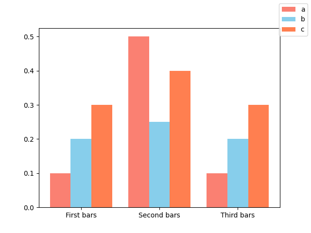

# multibarplot
Simple function to plot multiple barplots in the same figure. Supports padding and custom color.

# Usage
Exposes the function `grouped_barplot(ax, ys, x_positions=None, padding=0.1, colors=None, labels=None)`.

```python
import numpy as np
import matplotlib.pyplot as plt

from multibarplot import grouped_barplot

ys = np.array([[0.1, 0.2, 0.3], [0.5, 0.25, 0.4], [0.1, 0.2, 0.3]])
colors = ["salmon", "skyblue", "coral"]
labels = ["a", "b", "c"]

fig, ax = plt.subplots(1,1)
grouped_barplot(ax, ys, colors=colors, labels=labels)
ax.set_xticks(np.arange(3))
ax.set_xticklabels(["First bars", "Second bars", "Third bars"])
fig.legend()

plt.show()
```

## Optional parameters
`x_positions`: Set x ticks to put the barplots at. By default, it will start at index `0`.

`padding`: Padding between each set of bars. By default, this is set to `0.1`.

`colors`: Colors of bar plots. By default, it will pick Matplotlibs default colors.

`labels`: Optional label for each bar.


